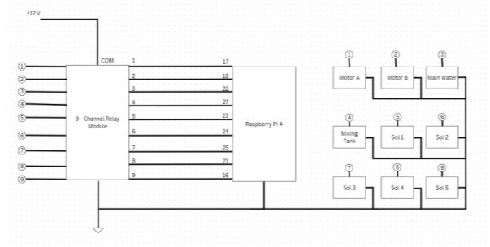
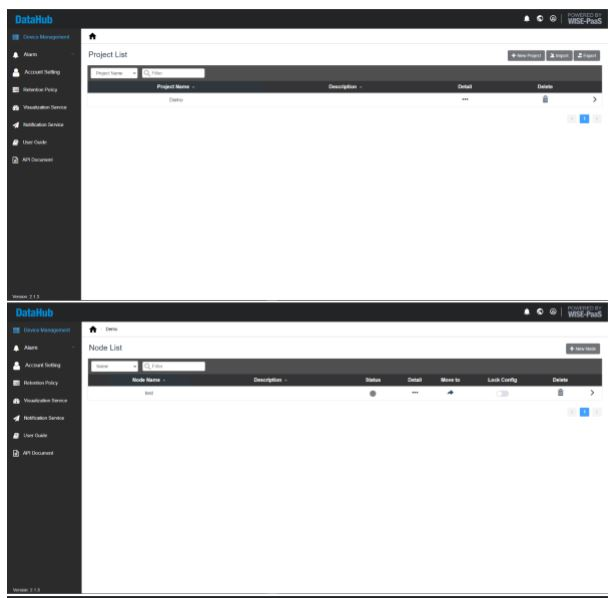
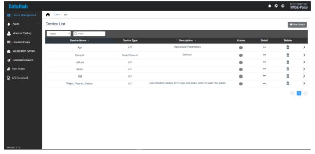
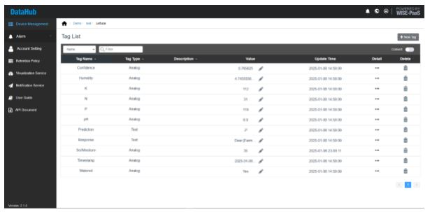
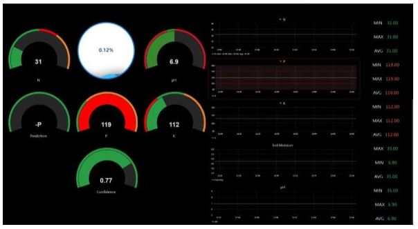
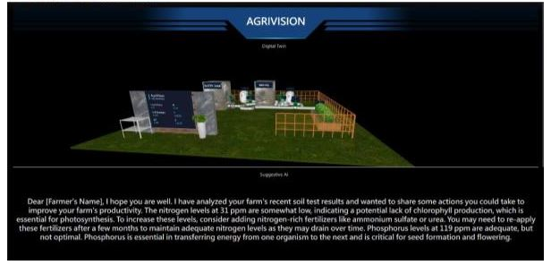
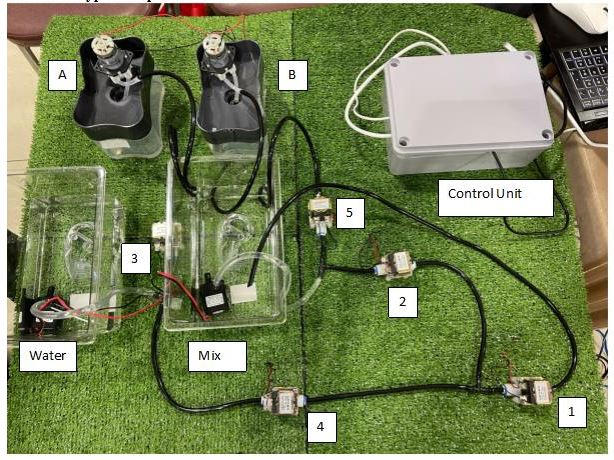

# AgriVision

This project is an IoT Agriculture Monitoring System. Equipped with Advantech's Dashboard and a Digital Twin for real-time data visualization. Equipped with MobileNetV2 as the vision system.

## Hardware Setup
- 1 Raspberry Pi 4B 8GB
- 1 Raspberry Pi 2B 8GB
- 1 Moisture Sensor
- 1 pH Sensor
- 1 NPK Sensor
- 1 Google Coral TPU
- 2 USB to RS485 Converter
- (OPTIONAL) 1 ADVANTECH ADAM 6217
- 1 Webcam
- 2 8-Channel Relay
- 2 Submersible Water Pump
- 5 1/4" Solenoid Valve
- 2 Peristaltic Pump

## Circuit Design

Connection between Raspberry Pi 4 and Relay.

## Datahub Implementation

The hierarchy of the system can be broken down as Project > Node > Device > Tag.

1. Project: This refers to which ever project is being developed. Multiple projects can be stored in Datahub which allows centralized project development.

2. Node: This refers to the IoT device placed or used on the Project. Nodes may be refered to as access points where different access points can be placed throughout the physical project to refer to a specific location of the system.

3. Device: This refers to the physical data collection device on the system. For example, a sensor collecting data can be referred as the device.

4. Tag: This refers to the data type being tracked by the sensor/device. A Tag must be setup in the Datahub to allow the sensor to transfer the data from the access point. The data type must be specified in Datahub.

## Dashboard Implementation

The dashboard displays real-time data sent from the sensors to datahub via MQTT. Datahub then uses the data to display the values on the dashboard.

## Digital Twin Implementation

The digital twin shows the current state of the farm. It shows which motors are currently running and the values of the data from the sensors.

## Prototype Example

A prototype was created to demonstrate the funtionality of the control system. The difference in NPK values and moisture values controls the amount of solution given to the farm.

## Vision System Implementation

By focusing on the detection of Nitrogen (N), Phosphorus (P), and Potassium (K) deficiencies in lettuce plants, the system aims to ensure optimal crop health while minimizing resource usage. 

This approach combines MobileNetV2, a lightweight model suitable for edge devices, enabling the model to perform efficiently in real-world agricultural environments.